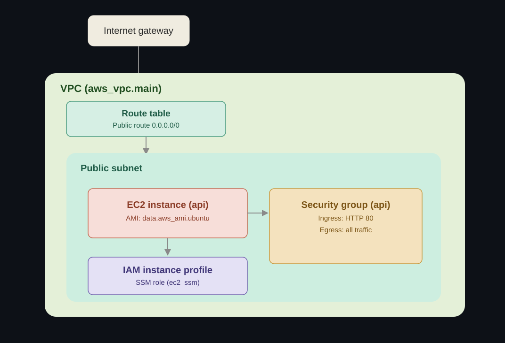

# Terraform FastAPI Helpdesk Infrastructure

Infrastructure as Code (IaC) project for deploying a containerized FastAPI Helpdesk application on AWS using Terraform.

The project provisions the AWS infrastructure required to run the application on an Ubuntu EC2 instance, including networking, security, Docker, PostgreSQL, Nginx and AWS Systems Manager Session Manager(No ssh).

## AWS Resources

Terraform provisions:

* VPC
* Public subnet
* Internet Gateway
* Public route table
* Security Group
* Ubuntu 24.04 EC2 instance
* IAM Role for EC2
* IAM Instance Profile
* AWS Systems Manager permissions 
* Docker and Docker Compose installation
* Application deployment through EC2 `user_data`

The infrastructure is intentionally kept simple and focused on demonstrating AWS, Terraform and DevOps fundamentals.

## Technology Stack

| Technology          | Purpose                        |
| ------------------- | ------------------------------ |
| Terraform           | Infrastructure as Code         |
| AWS EC2             | Application compute            |
| AWS VPC             | Network isolation              |
| AWS IAM             | Identity and permissions       |
| AWS Systems Manager | Secure instance administration |
| Ubuntu 24.04        | EC2 operating system           |
| Docker              | Application containerization   |
| Docker Compose      | Multi-container deployment     |
| Nginx               | Reverse proxy                  |
| FastAPI             | Backend API                    |
| PostgreSQL          | Database                       |

## Project Structure

```text
.
├── main.tf
├── providers.tf
├── variables.tf
├── outputs.tf
├── user_data.sh
├── .terraform.lock.hcl
├── terraform.tfvars.example
└── README.md
```

### `Main.tf`

Defines the main AWS infrastructure:

* VPC
* subnet
* Internet Gateway
* route table
* Security Group
* EC2
* IAM Role
* IAM Instance Profile
* SSM permissions

### `User_data.sh`

Bootstraps the EC2 instance.

The script:

1. Updates the operating system.
2. Installs Docker and Docker Compose.
3. Enables Docker.
4. Clones the FastAPI application repository. 
5. Creates the application's `.env` file from `.env.example`.
6. Builds and starts the Docker Compose stack.

### `Variables.tf`

Contains configurable infrastructure parameters such as:

* AWS region
* Availability Zone
* project name
* VPC CIDR
* subnet CIDR
* EC2 instance type
* SSH access CIDR

### `outputs.tf`

Returns useful information after deployment, including:

* EC2 public IP
* EC2 public DNS

## Application Deployment

The EC2 instance is automatically configured using `user_data`.

During the first boot Terraform's EC2 instance:

1. Installs Docker.
2. Installs Docker Compose.
3. Clones the application repository.
4. Starts the application stack.

The application repository is:

```text
https://github.com/Rubb-hub/fastapi-helpdesk-api
```

The Docker Compose stack contains:

* Nginx
* FastAPI
* PostgreSQL

Nginx acts as the reverse proxy and forwards requests to the FastAPI container.


## Prerequisites

Before deploying the infrastructure, install:

* Terraform >= 1.6
* AWS CLI
* An AWS account
* AWS credentials configured for Terraform -> 

⚠️ Verify your Terraform installation: ⚠️

```bash
terraform version
```

⚠️ Verify your AWS CLI installation and configuration: ⚠️

```bash
aws --version
```

```bash
aws sts get-caller-identity
```

## Deploy

1️⃣ **Clone the repo:**

 ```bash
 git clone https://github.com/Rubb-hub/terraform-fastapi-helpdesk-infrastructure.git
 cd terraform-fastapi-helpdesk-infrastructure
 ```

2️⃣ **Create a local Terraform variables file**

 ```bash
 cp terraform.tfvars.example terraform.tfvars
 ```

 ⚠️⚠️
 Note: a \`terraform.tfvars.example\` file with sample values is included. Copy it to 
 \`terraform.tfvars\` before running the project. It doesn't contain any real sensitive 
 information, but this separation is kept as a good practice.


 
3️⃣ **Initalice Terraform**

 ```bash
 terraform init
 ```

4️⃣ **Review the execution plan**

 ```bash
 terraform plan
 ```

5️⃣ **Create the infrastructure**

 ```bash
 terraform apply
 ```

6️⃣ **Confirm the deployment when prompted**

 After Terraform finishes, retrieve the EC2 public IP:

 ```bash
 terraform output ec2_public_ip
 ```

    And the public DNS name:

     ```bash
     terraform output ec2_public_dns
     ```


## Accessing the API

Once the EC2 instance has completed its bootstrap process, access the FastAPI documentation at:

```text
http://<EC2_PUBLIC_IP>/docs
```

The OpenAPI specification is available at:

```text
http://<EC2_PUBLIC_IP>/openapi.json
```

## Secure EC2 Administration with SSM

The EC2 instance is configured with an IAM Instance Profile containing the AWS managed policy:

```text
AmazonSSMManagedInstanceCore
```

This allows the instance to register with AWS Systems Manager and be accessed through Session Manager.

The goal is to avoid exposing SSH directly to the Internet.

Once the instance is available in Systems Manager, connect using:

```bash
aws ssm start-session --target <INSTANCE_ID>
```

Or use:

```text
AWS Console
→ EC2
→ Instances
→ Select instance
→ Connect
→ Session Manager
```

This approach avoids depending on the administrator's public IP address and provides an alternative to traditional SSH access.

## Security Considerations

The infrastructure currently exposes HTTP on port `80` to the Internet because Nginx is the public entry point for the application.


## Destroy Infrastructure

To remove the AWS infrastructure:

```bash
terraform destroy
```

Review the resources that will be deleted before confirming.

> AWS resources can incur costs. Destroy the infrastructure when it is no longer required.

## Related Repository

**FastAPI Helpdesk API source code** --> 🔗[fastapi-helpdesk-api](https://github.com/Rubb-hub/fastapi-helpdesk-api)

## Terraform Deployment IAM User

Terraform was executed using a dedicated custom IAM user rather than an AWS account root user or an administrator-level identity.

The IAM user has a custom policy designed specifically to provide the permissions required to deploy and manage the infrastructure defined in this repository.

The policy is divided into two permission groups:

### EC2 permissions

The policy grants the permissions required to create and manage the AWS infrastructure used by the project, including:

- VPCs
- Subnets
- Internet Gateways
- Route Tables
- Security Groups
- EC2 instances
- EC2 key pairs
- Network interfaces
- Instance profiles associations
- Resource tagging

### IAM permissions

Terraform was also granted permissions to create and manage the specific IAM Role and Instance Profile required by the EC2 instance to use AWS Systems Manager Session Manager.

The IAM permissions were restricted to specific AWS resource ARNs rather than allowing access to all IAM resources in the account.

The policy explicitly specified the following resources:

- `arn:aws:iam::<AWS_ACCOUNT_ID>:role/helpdesk-api-terraform-deployment-ssm-role`
- `arn:aws:iam::<AWS_ACCOUNT_ID>:instance-profile/helpdesk-api-terraform-deployment-ssm-instance-profile`

This restricted the Terraform deployment user to managing only the IAM Role and Instance Profile required by the project.

The `iam:PassRole` permission was also restricted to the specific SSM IAM Role used by the EC2 instance.

This approach provided an additional security boundary and followed the principle of least privilege more closely.

### Custom IAM Policy

The deployment user uses the following custom policy:

```json
{
  "Version": "2012-10-17",
  "Statement": [
    {
      "Sid": "EC2InfrastructureManagement",
      "Effect": "Allow",
      "Action": [
        "ec2:AuthorizeSecurityGroupIngress",
        "ec2:DeleteSubnet",
        "ec2:DescribeInstances",
        "ec2:DescribeInstanceAttribute",
        "ec2:CreateKeyPair",
        "ec2:CreateVpc",
        "ec2:AttachInternetGateway",
        "ec2:DescribeVpcAttribute",
        "ec2:DeleteRouteTable",
        "ec2:ModifySubnetAttribute",
        "ec2:AssociateRouteTable",
        "ec2:DescribeInternetGateways",
        "ec2:DescribeNetworkInterfaces",
        "ec2:DescribeAvailabilityZones",
        "ec2:CreateRoute",
        "ec2:CreateInternetGateway",
        "ec2:RevokeSecurityGroupEgress",
        "ec2:CreateSecurityGroup",
        "ec2:DescribeVolumes",
        "ec2:ModifyVpcAttribute",
        "ec2:DeleteInternetGateway",
        "ec2:DescribeKeyPairs",
        "ec2:AuthorizeSecurityGroupEgress",
        "ec2:TerminateInstances",
        "ec2:ImportKeyPair",
        "ec2:DescribeTags",
        "ec2:CreateTags",
        "ec2:DeleteRoute",
        "ec2:CreateRouteTable",
        "ec2:RunInstances",
        "ec2:DetachInternetGateway",
        "ec2:DisassociateRouteTable",
        "ec2:DescribeInstanceCreditSpecifications",
        "ec2:DescribeSecurityGroups",
        "ec2:RevokeSecurityGroupIngress",
        "ec2:DescribeImages",
        "ec2:DescribeSecurityGroupRules",
        "ec2:DescribeVpcs",
        "ec2:DeleteSecurityGroup",
        "ec2:DescribeInstanceTypes",
        "ec2:DeleteVpc",
        "ec2:CreateSubnet",
        "ec2:DescribeSubnets",
        "ec2:DeleteKeyPair",
        "ec2:DescribeIamInstanceProfileAssociations",
        "ec2:AssociateIamInstanceProfile"
      ],
      "Resource": "*"
    },
    {
      "Sid": "SSMIAMRoleManagement",
      "Effect": "Allow",
      "Action": [
        "iam:CreateInstanceProfile",
        "iam:DeleteInstanceProfile",
        "iam:GetRole",
        "iam:GetInstanceProfile",
        "iam:RemoveRoleFromInstanceProfile",
        "iam:CreateRole",
        "iam:DeleteRole",
        "iam:AttachRolePolicy",
        "iam:AddRoleToInstanceProfile",
        "iam:ListInstanceProfilesForRole",
        "iam:PassRole",
        "iam:DetachRolePolicy",
        "iam:ListRolePolicies",
        "iam:ListAttachedRolePolicies"
      ],
      "Resource": [
        "arn:aws:iam::851725338458:role/helpdesk-api-terraform-deployment-ssm-role",
        "arn:aws:iam::851725338458:instance-profile/helpdesk-api-terraform-deployment-ssm-instance-profile"
      ]
    }
  ]
}
```

## Architecture

